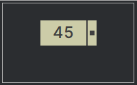
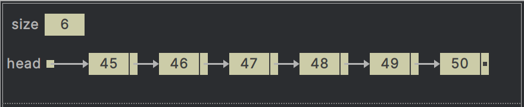
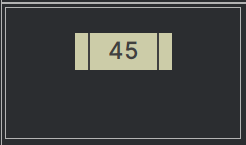
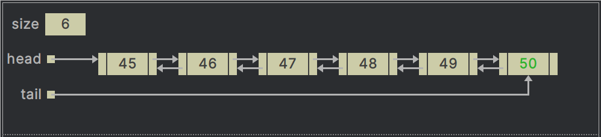
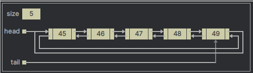

# Linked-Lists

An array is an indexed data structure, which means you can select its elements in arbitrary  order as determined by the 
index value. You can also access the elements in sequence using  a loop that increments the index.  
However, you can’t do the following with an array object:
- Increase or decrease its length, which is fixed.
- Add an element at a specified position without shifting the other elements to make room.
- Remove an element at a specified position without shifting the other elements to fill in the resulting gap.

In an unordered array, searching is slow, whereas in an ordered array, insertion is slow. In both kinds of arrays, deletion
is slow.

---

In this package you will find a 'Linked-List' Java class that will perform the following operations:

- Check if the linked-list is empty (isEmpty).
- Add an element at the end of the list (add).
- Remove an element (remove).
- Return the size of the list (size).
- Sequentially access all the list elements without having to manipulate an index (print).
- find a specified target value (search).

---

_Linked-Lists are probably the second most commonly used general-purpose data storage structures after arrays._

A Linked-List data structure provides the ability to add or remove items in the list in constant time i.e. O(1).
It is useful in cases when you need to insert and remove elements frequently. Each element in a linked-list, is called
a node, and stores information (data) and a "link" to the next node in the list. After we find the position of a node to
be inserted or removed, the actual insertion or removal is done in constant time and no shifts are required unlike an 
array.

A _node_ is a data structure that contains a data item and (usually) one or more links. A _link_ is a reference to another
node.

The _Linked-Lists_ are a versatile mechanism suitable for use in many kinds of general-purpose databases. It can also
replace an array as the basis for other storage structures such as _Stacks_ and _Queues_.

---

**Singly-Linked List**

  
representation of a node of a singly-linked list which has
- the data set as `45` and 
- the reference to the next node set as `null`.  

  
representation of a singly-linked list with size `6`

---

**Doubly-Linked List**

  
representation of a node of a doubly-linked list which has 
- the data set to `45`,
- the previous set to `null`, and
- the next also set to `null`

  
representation of a doubly-linked list with size `6`

---

**Circular Linked List**

Notice how the circular (doubly) linked list resembles a doubly linked list, the main difference is that
while the previous and next of the first and the last node respectively are null,
they point to the tail and the head nodes respectively in a circular linked list.

---

Suggested Viewing

1. [Linked Lists for Technical Interviews - Full Course](https://youtu.be/Hj_rA0dhr2I?si=iDD8w2hWVH1bxRS5)
2. [Data Structures: Linked Lists](https://youtu.be/njTh_OwMljA?si=IgWY9BgCtLmGz6rs)
3. [Linked List Complete Course | Data Structures & Algorithms | Types of Linked List in Java @SCALER](https://youtu.be/kn3PhQb8soI?si=CzjAXhuAGQAkMco2)
4. [Introduction to Linked List | Data Structures & Algorithms | Java Placement Course](https://youtu.be/oAja8-Ulz6o?si=2OkyE19ssno3WobO)
5. [Arrays vs Linked Lists - Computerphile](https://youtu.be/DyG9S9nAlUM?si=CWfia4jJFc9VYjI-)
6. [Linked Lists - Computerphile](https://youtu.be/_jQhALI4ujg?si=Lmz-dmfjgPtf60eP)