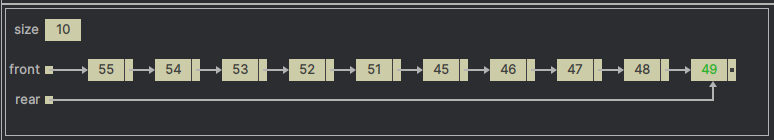

## Queue

A queue data structure is based on the principle of **FIFO (First-In, First-Out)** since the first element to inserted
would be the first element removed.

You can understand a queue as a line of customers waiting for scarce resource, such as line waiting to buy ticket to an
event, or anywhere you may have ever seen a "queue" formed in real-life. The word itself if _British_ for _line_(the type
of line you have to wait in).

Operating Systems make extensive use of queues. One application being managing process execution.
In a modern operating system, several processes may be executing at the same time and, therefore, may request
the same computer resource (for example, the CPU, the GPU, or a printer). The operating system stores these types of 
requests in a queue and then removes them so that the process is waiting the longest will be the next one ot get access 
to the desired resource.

---

  
Queue implemented using an array

  
Queue implemented using a linked list

Double-Ended Queue (DEQueue) allows enqueue and dequeue at both front and rear

  
Singly Circular Queue

  
Doubly Circular Queue

---

**Suggested Viewing**

1. [Data Structures: Stacks and Queues](https://youtu.be/wjI1WNcIntg?si=TJAzAmqKTS4BeMS4)
2. [Introduction to Stacks and Queues (Data Structures & Algorithms #12)](https://youtu.be/A3ZUpyrnCbM?si=xAYrBkq5_iDDYrWQ)
3. [Queue in Data Structure Course 2023 | Data Structures and Algorithm | FIFO Principle | @SCALER](https://youtu.be/pOoYDawChGk?si=OfQ9DZ5km6t9gipDa)