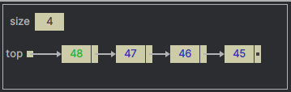
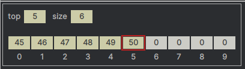

# Stacks

A "Stack" data structure is sometimes called as such since it resembles a "stack" of something e.g. a stack of plates
in a restaurant. In such a stack, the plate that is added last is put on the "top", and also would be the first one to 
be picked up. The plate that was added in the beginning would be at the bottom of the stack and would be picked up last 
after all the plates on the top of it are removed. Hence, this arrangement is also known as a **Last-In, First-Out (LIFO)** 
structure.

The operation of adding a new value to a stack is called "**push**", and the operation of removing a value from a stack 
is called "**pop**". The element that was pushed to the stack last should be popper first from the stack.
It is possible to return the top element from the stack without modifying it, the operation is called "**peek**".
A stack implementation is expected to have all operations in the same time complexity - **O(1)**.

---

In this package you will find a 'Stack' Java class that will perform the following operations:

- add an element at the top of the stack (push).
- remove an element from top of the stack (pop).
- check the next element to be popped from the stack (peek).
- check if the stack is empty (isUnderflow).
- return the size of the stack (getSize).

---

**Stack using a Linked-List**

  

This image represents a stack created using a singly-linked list  

**Stack using an Array**

  

This image represents a stack created using an array

--- 

[**Infix to Postfix Converter**](../stack/reference/converter/README.md)

---

Suggested Viewing

1. [Stack Data Structure Tutorial – Solve Coding Challenges](https://youtu.be/O1KeXo8lE8A?si=sRxg37NBbvMvFP4y)
2. [Data Structures: Stacks and Queues](https://youtu.be/wjI1WNcIntg?si=st3hqnAG88Mt-YZs)
3. [Introduction to Stacks and Queues (Data Structures & Algorithms #12)](https://youtu.be/A3ZUpyrnCbM?si=92TDbM0OmcUdOBJH)
4. [Intro to Stacks – Data Structure Explained](https://youtu.be/k1IaYPGel3s?si=I1a9xCL0MTY-d4fU)